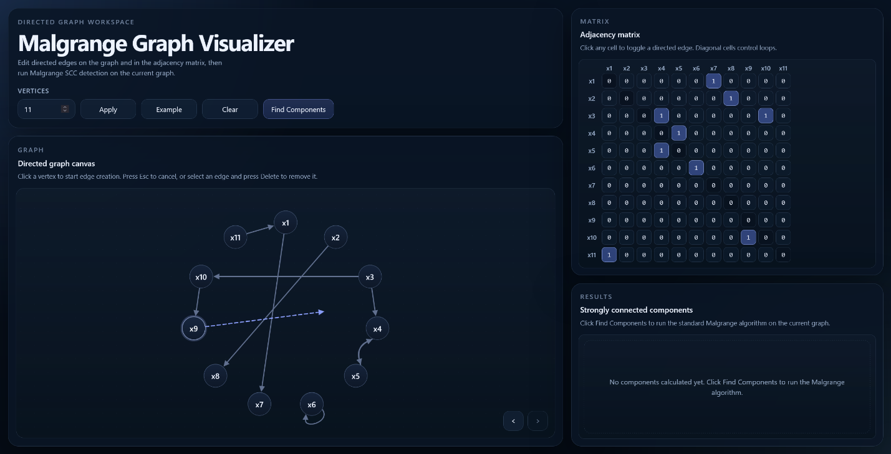
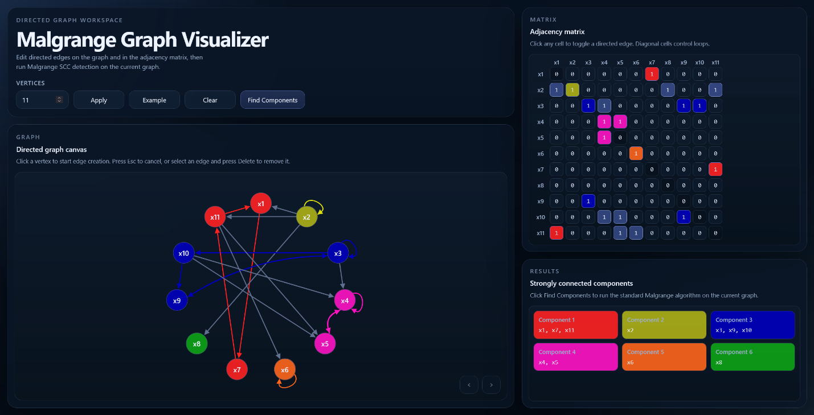
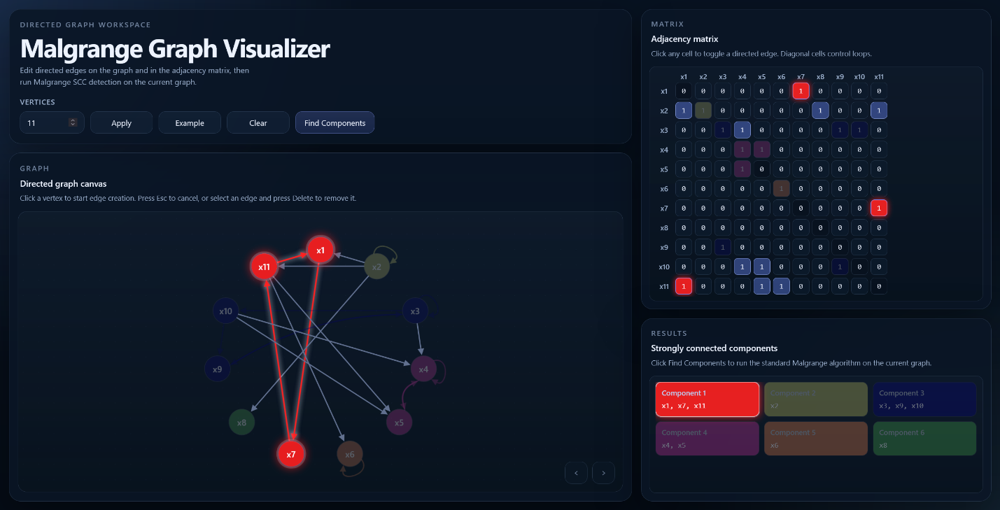

# Malgrange Graph Visualizer

Локальное React-приложение для построения и редактирования ориентированного графа, синхронной работы с матрицей смежности и поиска компонент сильной связности стандартным алгоритмом Мальгранжа.

## Скриншоты







## Возможности

- создание и удаление ориентированных дуг на графе;
- редактирование дуг через матрицу смежности;
- поддержка петель;
- двусторонняя синхронизация графа и матрицы;
- undo/redo для действий с дугами;
- запуск алгоритма Мальгранжа;
- цветовая подсветка найденных компонент сильной связности.

## Стек

- React;
- Vite;
- TypeScript;
- React Flow (`@xyflow/react`);
- Playwright;
- ESLint.

## Быстрый старт

```bash
npm install
npm run dev
```

Сборка проекта:

```bash
npm run build
```

Unit-тесты:

```bash
npm run test:unit
```

## Структура проекта

- `src/app` - корневой слой приложения и сборка основных экранов.
- `src/components` - UI-компоненты графа, матрицы, панели управления, модальных окон и результатов.
- `src/hooks` - хуки для управления графом, undo/redo и запуском алгоритма.
- `src/model` - типы, состояние графа, операции над дугами и пример графа.
- `src/algorithms` - алгоритм Мальгранжа и обход достижимости.
- `src/utils` - функции для матрицы, id, цветов, геометрии дуг и раскладки вершин.
- `tests` - тесты Playwright.

## Алгоритм

Алгоритм Мальгранжа отделён от UI-слоя и не зависит от React Flow. Перед запуском состояние приложения преобразуется в упрощённую структуру `SimpleGraph`, которая содержит вершины, прямой список смежности и обратный список смежности.
